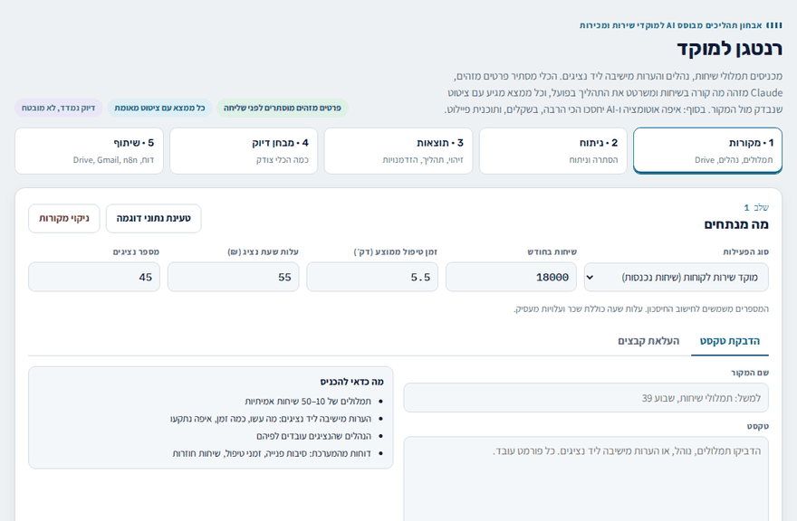
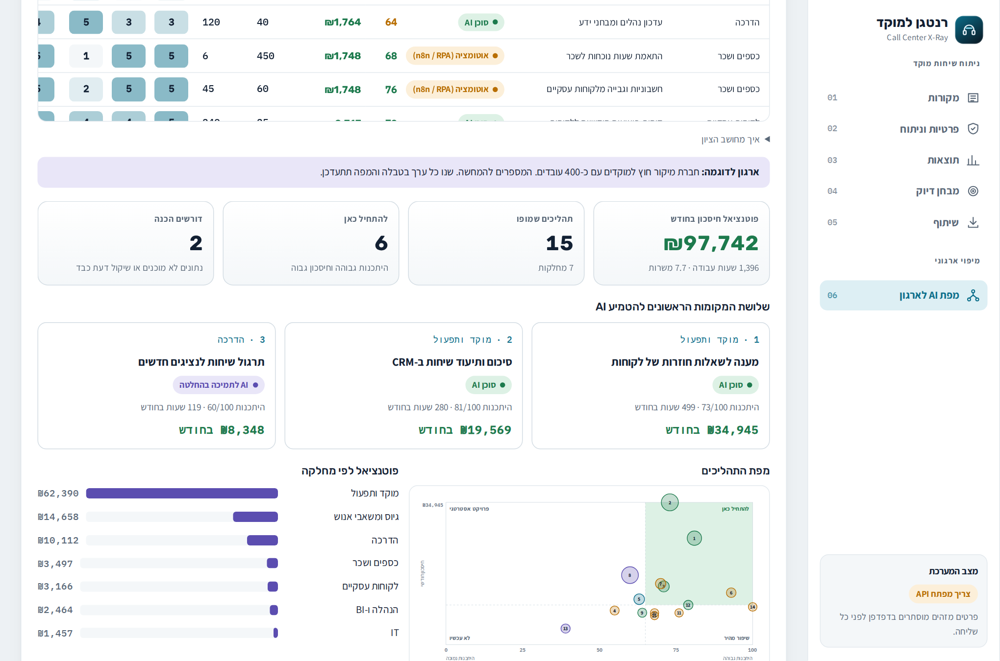
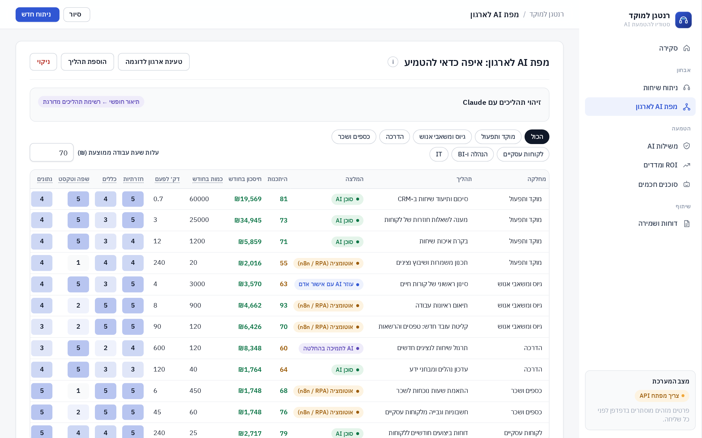
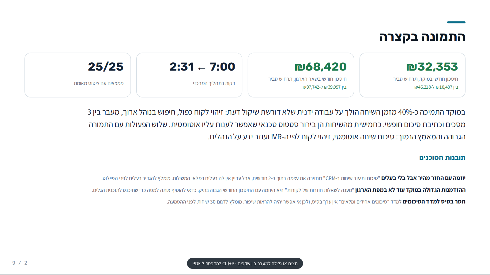
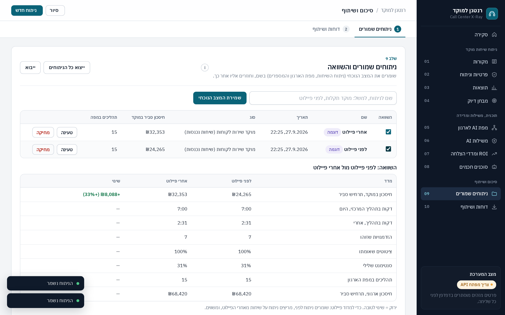
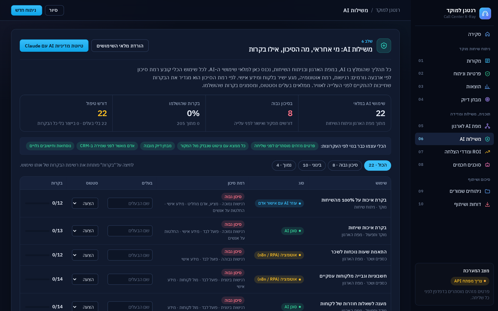
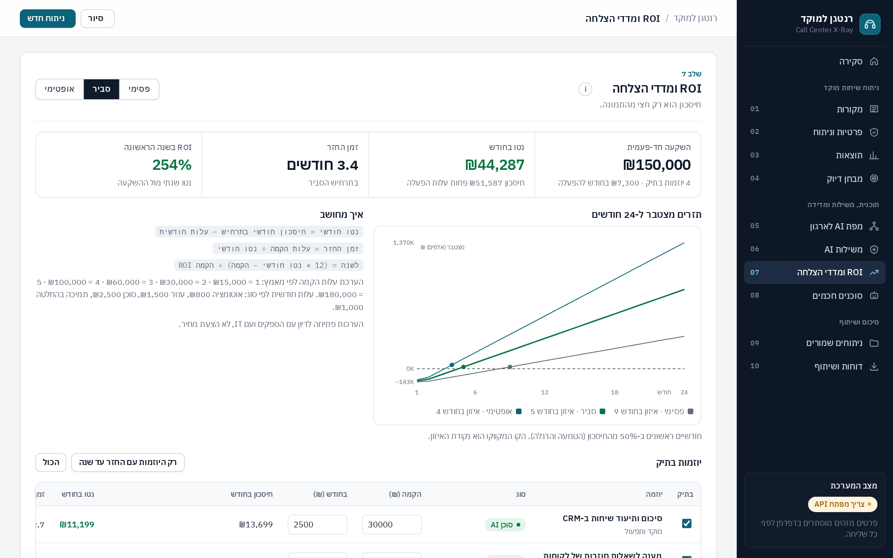
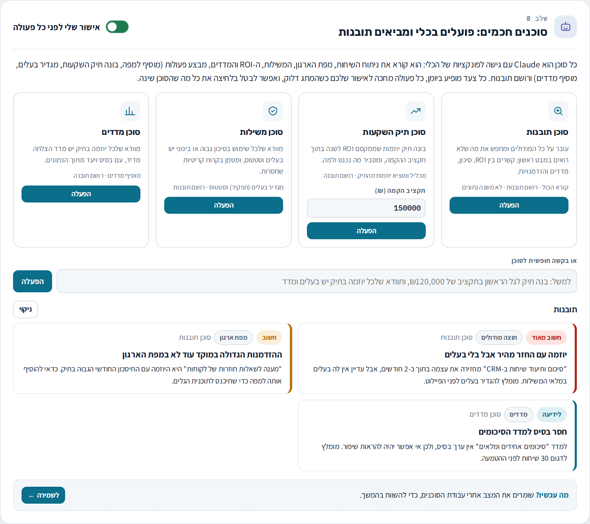
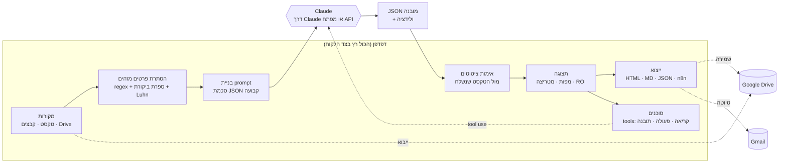

<div dir="rtl">

# רנטגן למוקד · Call Center X-Ray

[](https://github.com/E37dey/callcenter-xray/actions/workflows/tests.yml)  

**אבחון תהליכים, איתור הזדמנויות AI ואוטומציה, משילות AI, ROI ומדדי הצלחה, וסוכנים חכמים שפועלים בתוך הכלי: במוקד השירות ובארגון כולו, בעזרת Claude.**

שני מסלולים:
1. **ניתוח שיחות מוקד:** מתמלולים, נהלים ותצפיות אל מפת תהליך, הזדמנויות עם ציטוטים מאומתים וחיסכון בשקלים.
2. **מפת AI לארגון:** מיפוי תהליכים בכל המחלקות, ציון התאמה שקוף לכל תהליך, המלצה על סוג הפתרון ותוכנית הטמעה בשלושה גלים.

מכניסים תמלולי שיחות, נהלים והערות מישיבה ליד נציגים. הכלי מסתיר פרטים מזהים, מזהה מה קורה בשיחות, משרטט את התהליך כפי שהוא קורה בפועל, ומדרג איפה אוטומציה ו-AI יחסכו הכי הרבה זמן, בשקלים. כל ממצא מגיע עם ציטוט מהמקור, והכלי בודק אוטומטית שהציטוט באמת מופיע שם.



> נתוני הדוגמה בריפו בדויים (מוקד תמיכה של ספק אינטרנט). הפרויקט אינו קשור לחברה מסוימת.

> פרויקט קשור: [factory-floor-mcp](https://github.com/E37dey/factory-floor-mcp), שרת MCP לקריאה בלבד שמחבר את Claude לנתוני רצפת ייצור (Excel ו-SAP), עם סיווג מידע ויומן ביקורת.

## למה זה קיים

הטמעת AI במוקד נכשלת בדרך כלל באחת משתי נקודות: בונים כלי לפני שמבינים איך העבודה נראית באמת, או שאי אפשר לסמוך על מה שהמודל אומר. הכלי בנוי סביב שלוש החלטות:

1. **קודם מבינים את התהליך, אחר כך בונים.** הקלט המרכזי הוא תצפית ותמלולים, והפלט הראשון הוא מפת התהליך בפועל ונקודות הכאב בה.
2. **פרטיות לפני הכול.** פרטים מזהים מוסתרים בדפדפן, לפני שהטקסט יוצא מהמחשב.
3. **אמון נמדד, לא מובטח.** כל טענה מגובה בציטוט שנבדק מול המקור, ויש מבחן דיוק מובנה.

## מה הכלי עושה

| שלב | מה קורה |
|---|---|
| **מקורות** | הדבקת טקסט, העלאת קבצים (‎.txt, ‎.csv, ‎.md, ‎.vtt ועוד), או ייבוא מסמכים מ-Google Drive |
| **הגנה על פרטיות** | הסתרה של ת.ז (כולל בדיקת ספרת ביקורת), טלפונים, כרטיסי אשראי (בדיקת Luhn), מיילים, IBAN ושמות, ורשימת מילים אישית. יש תצוגה מקדימה של מה שנשלח בפועל |
| **זיהוי** | סיבות פנייה וזמן טיפול לכל סוג, סנטימנט, חריגות מנוהל, ושאלות שחוזרות עם או בלי נוהל |
| **מפת תהליך** | התהליך לפי שחקנים (לקוח, נציג, מערכת, ראש צוות) ונקודות הכאב בו, עם מעבר בין לפני לאחרי והשוואת זמנים |
| **הזדמנויות** | מטריצת השפעה מול מאמץ, חישוב חיסכון (שיחות × אחוז מושפע × שניות × עלות שעה), שלבי יישום, כלים, מדדים וסיכונים |
| **ראיות** | ציטוט לכל ממצא, עם סימון "נמצא במקור ✓" או "לא נמצא מילה במילה", והקשר מסביב לציטוט |
| **פיילוט** | תוכנית של 4 עד 8 שבועות עם מדד הצלחה |
| **שאלו את האנליסט** | שיחת המשך שמבוססת על הניתוח בלבד |
| **מבחן דיוק** | סיווג שיחות מתויגות ומדידת accuracy, recall ו-precision, עם רשימת הטעויות |
| **מפת AI לארגון** | טבלת תהליכים לפי מחלקה עם שישה מדדים (חזרתיות, כללים, שפה, נתונים, שיקול דעת, רגישות), ציון היתכנות בנוסחה גלויה, חיסכון חודשי, המלצה (אוטומציה, סוכן AI, עוזר עם אישור אדם, תמיכה בהחלטה, קודם לסדר נתונים), מפת בועות של היתכנות מול חיסכון ותוכנית בשלושה גלים. אפשר לתאר את הארגון במילים ו-Claude יציע את רשימת התהליכים |
| **תרחישי חיסכון** | החיסכון מוצג כטווח: פסימי (40% מהערכת המודל), סביר (70%) ואופטימי (100%), כי ההזדמנויות חופפות והאימוץ לא מלא |
| **משילות AI** | מלאי של כל שימושי ה-AI שהומלצו. לכל שימוש: רמת סיכון (נמוך, בינוני, גבוה) לפי רגישות, אוטונומיה, מגע בלקוח ומידע אישי, עם נימוק גלוי; בעלים וסטטוס; רשימת בקרות חובה שנגזרת מהסיכון (עד 15 בקרות, למשל תסקיר השפעה, בדיקת הטיה, אדם בלולאה, גילוי ללקוח, מדיניות שמירה). התרעה על שימוש בייצור בלי כל הבקרות, ייצוא המלאי, וטיוטת מדיניות AI לארגון שנכתבת עם Claude. מבוסס על תיקון 13 לחוק הגנת הפרטיות, טיוטת הנחיית הרשות להגנת הפרטיות, מדיניות ה-AI הישראלית, ISO/IEC 42001 ו-NIST AI RMF (מסגרת עבודה, לא ייעוץ משפטי) |
| **ROI ומדדי הצלחה** | תיק יוזמות עם עלות הקמה ועלות חודשית לכל יוזמה (הערכה אוטומטית לפי רמת המאמץ וסוג הפתרון, וניתנת לעריכה), נטו חודשי, זמן החזר ו-ROI לשנה בשלושת התרחישים, וגרף תזרים מצטבר ל-24 חודשים עם נקודת איזון. טבלת KPI שנבנית מהניתוח (זמן טיפול, זמן תהליך, שיחות בלי מספר פנייה, אימוץ, דיוק, חיסכון בפועל) עם בסיס, יעד, ערך בפועל וסטטוס התקדמות |
| **סוכנים חכמים** | ארבעה סוכנים מוכנים (תובנות, תיק השקעות בתוך תקציב, משילות, מדדים) ובקשה חופשית. הסוכן מקבל פונקציות של הכלי כ-tools: קורא את הנתונים מכל המודולים, מבצע פעולות (הוספה למפה, הכללה בתיק, עדכון עלויות, בעלים וסטטוס, הוספת מדד) ורושם תובנות. כל פעולה מחכה לאישור (אפשר לכבות), כל צעד מופיע ביומן, ואפשר לבטל בלחיצה את כל מה שהסוכן שינה. הסוכן לא יכול להעביר שימוש לייצור |
| **אפליקציה עם מסכים** | דשבורד סקירה (חיסכון, ROI, זמן תהליך, ציטוטים מאומתים, ההזדמנויות המובילות, תזרים, מפת הארגון, משילות, תובנות והצעדים הבאים), ומסך נפרד לכל אזור עם ניווט צד ותת-ניווט לשלבי ניתוח השיחות. ההסברים מאחורי כפתור מידע, כדי שכל מסך ייפתח נקי |
| **הדרכה בתוך הכלי** | סיור מודרך של 11 צעדים בכניסה הראשונה (אפשר להפעיל שוב מסרגל הצד), ובסוף כל שלב "מה עכשיו?" עם קישור לשלב הבא |
| **הקלטות** | תמלול בעברית של קובצי שמע דרך Whisper (OpenAI או Groq) בגרסה העצמאית, סקריפט מקומי עם מודל ivrit.ai שלא שולח שמע החוצה, וקריאת VTT/SRT בלי חותמות זמן |
| **ניתוחים שמורים** | שמירת המצב הנוכחי בשם, טעינה, ייצוא וייבוא, והשוואה בין שני ניתוחים (למשל לפני ואחרי פיילוט) עם שינוי באחוזים |
| **מצגת משולבת** | תשעה שקפים שמאחדים את שני המסלולים: תקציר (כולל תובנות הסוכנים), המוקד, ההזדמנויות המובילות, מפת הארגון, שלושה גלים ופיילוט, ROI ומדדים, משילות AI, הנחות. ניווט בחצים והדפסה ל-PDF |
| **שיתוף** | דוח מנהלים של עמוד אחד (HTML), דוח מלא (Markdown), JSON, שמירה ב-Google Drive, טיוטת Gmail, וטיוטת workflow ל-n8n לכל הזדמנות |





| מצגת משולבת | השוואה לפני ואחרי פיילוט |
|---|---|
|  |  |







> התובנות בצילום הן דוגמה להמחשת התצוגה, על נתוני הדמו.

## ארכיטקטורה



- **קובץ אחד, בלי שרת.** `index.html` אחד עם HTML, CSS ו-JavaScript. אין build ואין תלויות.
- **שכבת LLM מופשטת.** בתוך Claude הכלי משתמש ביכולת ה-`sample` של הדף, ובחיבורים ל-Drive ו-Gmail של המשתמש. מחוץ ל-Claude הוא קורא ישירות ל-Anthropic API עם מפתח שהמשתמש מזין, ששמור רק ב-sessionStorage.
- **פלט מובנה.** המודל מחזיר JSON לפי סכמה קבועה. הקוד מנקה ומגביל ערכים (effort ו-impact בין 1 ל-5, אחוזים בין 0 ל-100), ומחשב את החיסכון בעצמו ולא סומך על מספרים מהמודל.
- **אימות ציטוטים.** כל ציטוט מחופש בטקסט שנשלח בפועל, אחרי נרמול של רווחים ומירכאות. ציטוט שלא נמצא מסומן לבדיקה ידנית.

## הרצה

**1. בתוך Claude:** מפרסמים את `index.html` כ-Artifact עם היכולות `sample`, `downloads` ו-`mcp` (Google Drive, Gmail). הניתוח רץ על החשבון של המשתמש.

**2. GitHub Pages:** Settings ← Pages ← Deploy from branch ← `main` / root. פותחים את הקישור, מזינים מפתח API של Anthropic, ומריצים.

**3. מקומית:** פותחים את `index.html` בדפדפן. נתוני הדוגמה מוצגים גם בלי מפתח.

## בדיקות אוטומטיות

53 בדיקות Playwright רצות ב-GitHub Actions על כל שינוי, במחשב ובמסך טלפון:

- **פרטיות:** ת.ז, טלפון, כרטיס, מייל ושם מוסתרים; מספרים שלא עוברים ספרת ביקורת או Luhn לא מוסתרים; מילים אישיות מוסתרות.
- **ניתוח חי מול Claude מדומה:** הבקשה ל-API מיורטת, והבדיקה מוודאת שהטקסט שיצא מהדפדפן כבר מוסתר, שה-JSON עובר ולידציה, ושציטוט שהמודל "המציא" מסומן כלא נמצא.
- **חישובים:** שלושת התרחישים שומרים על יחס 40/70/100, והחיסכון מתעדכן כשמשנים את מספר השיחות.
- **מפת הארגון:** שינוי ציון משנה את ההיתכנות ואת ההמלצה, והזדמנויות מהמוקד נוספות למפה פעם אחת בלבד.
- **מסכים:** הסקירה נפתחת ראשונה ורק מסך אחד גלוי; ניווט הצד ותת-הניווט מחליפים מסכים; כרטיסי הדשבורד מובילים למסך המתאים; ההסברים נפתחים בכפתור מידע.
- **ממשק:** מעבר לפני/אחרי, מבחן דיוק מול תשובות מדומות, ייצוא, ניווט בסרגל הצד, ואין גלילה אופקית בטלפון.
- **הדרכה ושמירה:** הסיור עובר על כל השלבים ונזכר שנסגר; שמירה, השוואה מהישן לחדש, טעינה, ייצוא וייבוא.
- **משילות:** כל שימוש נכנס למלאי עם רמת סיכון; סינון קורות חיים מסווג כגבוה ודורש תסקיר ובדיקת הטיה; בעלים, סטטוס ובקרות נשמרים ונספרים; טיוטת המדיניות נבנית מהמלאי.
- **ROI ומדדים:** זמן ההחזר וה-ROI תואמים לנוסחה; הכללה והחרגה ועריכת עלויות משנות את הסכומים ונשמרות; סטטוס מדד לפי ההתקדמות מהבסיס ליעד בשני הכיוונים.
- **סוכנים מול Claude מדומה:** לולאת tool use מלאה; הסוכן מקבל רק את הכלים שלו; שום דבר לא משתנה לפני אישור; פעולה שנדחתה לא מתבצעת והמודל מקבל על כך הודעה; ביטול מחזיר את כל השינויים.
- **הקלטות ומצגת:** תמלול מול Whisper מדומה (כולל המפתח שנשלח), חסימה בלי מפתח, ניקוי VTT, ותשעת השקפים של המצגת.

```bash
npm ci
npx playwright install chromium
npm test
```

## מבחן דיוק משורת הפקודה

```bash
pip install anthropic
export ANTHROPIC_API_KEY=sk-ant-...
python eval/run_eval.py                        # מאגר הדמו המובנה (16 שיחות, 6 קטגוריות)
python eval/run_eval.py my_calls.csv --redact  # מאגר שלכם, עם הסתרת פרטים
```

הסקריפט מריץ את אותו סיווג כמו הכלי ומדפיס דיוק כולל, recall ו-precision לכל קטגוריה, ואת הטעויות. `dataset.csv` כולל שיחות דמו קצרות. על שיחות אמיתיות התוצאה יכולה להיות שונה, ולכן מריצים את המבחן גם עליהן.

## מבנה הריפו

```
index.html            הכלי עצמו (קובץ אחד)
tests/                בדיקות Playwright
.github/workflows/    הרצת הבדיקות ב-GitHub Actions
eval/run_eval.py      מבחן דיוק משורת הפקודה
tools/transcribe.py   תמלול מקומי של הקלטות בעברית (faster-whisper + ivrit.ai)
eval/dataset.csv      שיחות דמו מתויגות
samples/              מקורות הדמו: הערות תצפית, תמלולים, נוהל
docs/                 צילומי מסך ו-GIF
```

## מגבלות וכיוונים להמשך

- **תמלול:** אין עדיין הפרדת דוברים (נציג/לקוח) אוטומטית; התמלול מחזיר טקסט רציף. בתוך Claude הדף לא יכול לשלוח שמע לשירות חיצוני, ולכן שם משתמשים בסקריפט המקומי או ב-VTT/SRT.
- **שמירה:** הניתוחים נשמרים בדפדפן. לעבודה משותפת צריך שרת או מסד נתונים.
- **Process mining:** מפת התהליך מבוססת היום על תמלולים ותצפית. חיבור ל-[PM4Py](https://github.com/process-intelligence-solutions/pm4py) על יומני אירועים מה-CRM ייתן מפה מבוססת נתוני מערכת.
- **הסתרת שמות:** זיהוי שמות מבוסס על ביטויים כמו "קוראים לי". זיהוי ישויות מלא בעברית (NER) ישפר אותו.
- **היקף:** ניתוח אחד מוגבל לכ-24 אלף תווים. למאגרים גדולים צריך ניתוח במנות וסיכום מדורג.
- **מספרים:** החיסכון הוא הערכה מתוך המקורות. ההזדמנויות חופפות בחלקן, ולכן הסכום הוא גבול עליון עד שמודדים בפיילוט.

## השראה והכרת תודה

- [CallLens](https://github.com/yablokolabs/CallLens): הרעיון שכל ציון מגובה בראיה מתוך השיחה.
- [mlrun/demo-call-center](https://github.com/mlrun/demo-call-center): הסתרת פרטים מזהים לפני ניתוח.
- [PM4Py](https://github.com/process-intelligence-solutions/pm4py): הכיוון להמשך בתחום ה-process mining.

## מחבר

**איליה נודלמן**: הטמעת פתרונות AI, הדרכה והובלת תהליכים, אוטומציה.

</div>

---

## English summary

**Call Center X-Ray** turns call transcripts, procedures and shadowing notes into a process diagnosis. It masks personal data in the browser, maps the as-is process by actor, ranks automation and AI opportunities by estimated monthly savings, and backs every finding with a quote that is automatically checked against the source text.

- Single-file web app (`index.html`), no build, no server. Runs inside Claude (Artifact with `sample`, `downloads`, `mcp`) or standalone with your own Anthropic API key.
- PII masking before anything leaves the browser: Israeli ID (checksum), phone, credit card (Luhn), email, IBAN, names after common phrases, custom terms.
- Structured JSON output with validation. ROI is computed in code: calls × affected share × seconds saved × hourly cost.
- Quote verification against the text actually sent, with as-is and to-be process maps.
- Built-in accuracy test (UI and `eval/run_eval.py`) with accuracy, per-label recall and precision.
- Exports: one-page executive report (HTML), full report (Markdown), JSON, Google Drive doc, Gmail draft, and an n8n workflow draft per opportunity.

- AI governance register: risk tier per AI use (sensitivity, autonomy, customer-facing, personal data) with required controls, owners and status, a live-without-controls alert, CSV export and a Claude-drafted AI usage policy. Grounded in Israel's Privacy Protection Law Amendment 13, the draft PPA AI guideline, Israel's AI policy, ISO/IEC 42001 and NIST AI RMF.
- ROI and KPIs: one-time and monthly cost per initiative, payback, 12-month ROI and a 24-month cumulative cash-flow chart in three scenarios; a KPI tracker seeded from the analysis with baseline, target, actual and status.
- Smart agents: four preset agents (insights, budget-constrained ROI portfolio, governance, KPIs) plus free-form requests. Agents call the page's own functions as tools (read, act, record insight) through Claude tool use, with per-action approval, a visible trace and one-click undo.
- Guided tour, 'what now' links at the end of every step, saved analyses with before/after comparison, a nine-slide combined deck, and Hebrew audio transcription (Whisper API in the standalone build, or a local ivrit.ai script).
- Organization-wide AI map: score any process on six criteria with a transparent formula, get a recommended solution type, a feasibility-vs-savings bubble map and a three-wave rollout plan; or describe the organization and let Claude propose the process inventory.

Demo data is fictional. MIT License.
